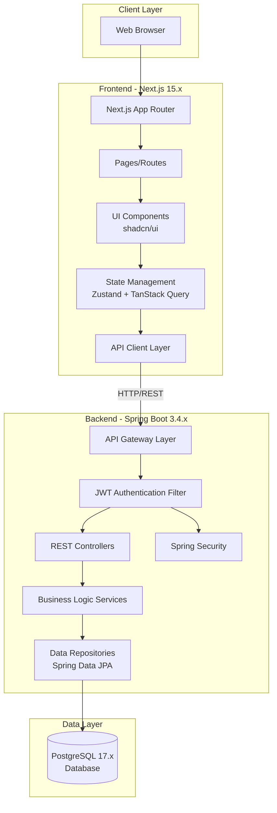
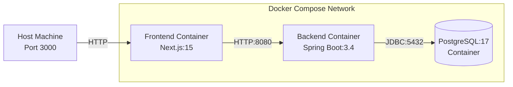
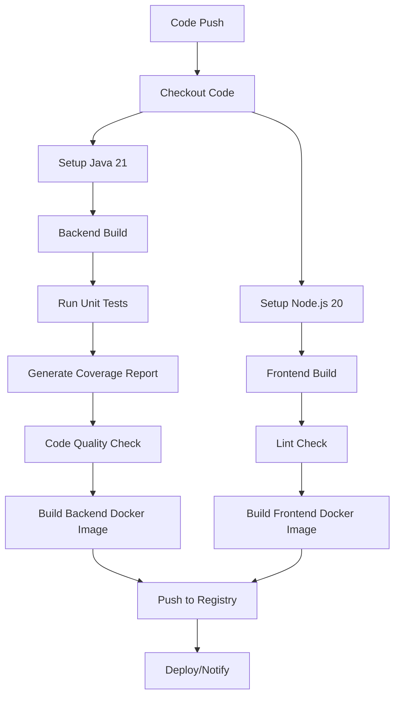

# Design Document

## Overview

The Simple Diaries App is architected as a modern full-stack application with clear separation between frontend and backend services. The system follows a microservices-inspired approach where the Next.js frontend communicates with a Spring Boot backend via RESTful APIs, with PostgreSQL serving as the persistent data store. The architecture emphasizes security, scalability, and developer experience through containerization and automated CI/CD pipelines.

### Technology Stack

**Backend:**
- Spring Boot 3.4.x with Java 21 LTS
- Spring Security with JWT authentication
- Spring Data JPA for database operations
- PostgreSQL 17.x database
- JUnit 5 and MockMvc for testing
- JaCoCo for code coverage analysis

**Frontend:**
- Next.js 15.x with App Router
- TypeScript for type safety
- shadcn/ui component library
- Tailwind CSS for styling
- Zustand for global state management
- TanStack Query (React Query) for server state
- GSAP and Framer Motion for animations
- React Hook Form with Zod for form validation

**DevOps:**
- Docker and Docker Compose for containerization
- GitHub Actions for CI/CD
- Multi-stage Docker builds for optimization

## Architecture

### System Architecture Diagram



### Layered Architecture

**Frontend Layers:**
1. **Presentation Layer**: React components, pages, and layouts
2. **State Management Layer**: Zustand stores and TanStack Query hooks
3. **API Integration Layer**: HTTP client with interceptors for authentication
4. **Validation Layer**: Client-side form validation with Zod schemas

**Backend Layers:**
1. **Controller Layer**: REST endpoints, request/response handling
2. **Service Layer**: Business logic, transaction management
3. **Repository Layer**: Data access abstraction via Spring Data JPA
4. **Security Layer**: JWT authentication, authorization filters
5. **Data Layer**: PostgreSQL database with JPA entities

## Components and Interfaces

### Backend Components

#### 1. Authentication Module

**Components:**
- `AuthController`: Handles registration, login, and token refresh endpoints
- `AuthService`: Implements authentication business logic
- `JwtTokenProvider`: Generates and validates JWT tokens
- `JwtAuthenticationFilter`: Intercepts requests to validate JWT tokens
- `UserDetailsServiceImpl`: Loads user details for Spring Security

**Key Interfaces:**
```java
// Authentication Request/Response DTOs
public class RegisterRequest {
    private String email;
    private String password;
    private String fullName;
}

public class LoginRequest {
    private String email;
    private String password;
}

public class AuthResponse {
    private String token;
    private String tokenType = "Bearer";
    private Long expiresIn;
    private UserDto user;
}
```

**Security Configuration:**
- JWT secret key stored in environment variables
- Token expiration: 24 hours
- BCrypt password encoder with strength 12
- Stateless session management

#### 2. User Management Module

**Components:**
- `User` (Entity): JPA entity representing user data
- `UserRepository`: Spring Data JPA repository for user operations
- `UserService`: User-related business logic

**User Entity Schema:**
```java
@Entity
@Table(name = "users")
public class User {
    @Id
    @GeneratedValue(strategy = GenerationType.IDENTITY)
    private Long id;
    
    @Column(unique = true, nullable = false)
    private String email;
    
    @Column(nullable = false)
    private String password; // BCrypt hashed
    
    @Column(nullable = false)
    private String fullName;
    
    @CreationTimestamp
    private LocalDateTime createdAt;
    
    @UpdateTimestamp
    private LocalDateTime updatedAt;
    
    @OneToMany(mappedBy = "user", cascade = CascadeType.ALL)
    private List<DiaryEntry> diaryEntries;
}
```

#### 3. Diary Entry Module

**Components:**
- `DiaryEntryController`: REST endpoints for CRUD operations
- `DiaryEntryService`: Business logic for diary management
- `DiaryEntryRepository`: Data access with custom query methods
- `DiaryEntry` (Entity): JPA entity for diary entries

**DiaryEntry Entity Schema:**
```java
@Entity
@Table(name = "diary_entries", indexes = {
    @Index(name = "idx_user_date", columnList = "user_id,entry_date"),
    @Index(name = "idx_entry_date", columnList = "entry_date")
})
public class DiaryEntry {
    @Id
    @GeneratedValue(strategy = GenerationType.IDENTITY)
    private Long id;
    
    @Column(nullable = false)
    private String title;
    
    @Column(columnDefinition = "TEXT", nullable = false)
    private String content;
    
    @Column(nullable = false)
    private LocalDate entryDate;
    
    @ManyToOne(fetch = FetchType.LAZY)
    @JoinColumn(name = "user_id", nullable = false)
    private User user;
    
    @CreationTimestamp
    private LocalDateTime createdAt;
    
    @UpdateTimestamp
    private LocalDateTime updatedAt;
}
```

**REST API Endpoints:**
```
POST   /api/diary-entries          - Create new entry
GET    /api/diary-entries          - Get all user's entries (paginated)
GET    /api/diary-entries/{id}     - Get specific entry
PUT    /api/diary-entries/{id}     - Update entry
DELETE /api/diary-entries/{id}     - Delete entry
GET    /api/diary-entries/search   - Search with filters
```

#### 4. Search Module

**Components:**
- `SearchService`: Implements full-text search and filtering logic
- Custom repository methods for complex queries

**Search Implementation:**
- PostgreSQL full-text search using `to_tsvector` and `to_tsquery`
- Query parameters: `keyword`, `startDate`, `endDate`, `date`
- Pagination support with Spring Data Pageable

**Repository Method Example:**
```java
@Query("SELECT d FROM DiaryEntry d WHERE d.user.id = :userId " +
       "AND (LOWER(d.title) LIKE LOWER(CONCAT('%', :keyword, '%')) " +
       "OR LOWER(d.content) LIKE LOWER(CONCAT('%', :keyword, '%'))) " +
       "AND d.entryDate BETWEEN :startDate AND :endDate")
Page<DiaryEntry> searchEntries(
    @Param("userId") Long userId,
    @Param("keyword") String keyword,
    @Param("startDate") LocalDate startDate,
    @Param("endDate") LocalDate endDate,
    Pageable pageable
);
```

### Frontend Components

#### 1. Authentication Components

**Pages:**
- `/login` - Login page
- `/register` - Registration page

**Components:**
- `LoginForm`: Login form with validation
- `RegisterForm`: Registration form with validation
- `AuthGuard`: HOC/wrapper for protected routes

**State Management:**
```typescript
// Zustand auth store
interface AuthState {
  user: User | null;
  token: string | null;
  isAuthenticated: boolean;
  login: (email: string, password: string) => Promise<void>;
  register: (data: RegisterData) => Promise<void>;
  logout: () => void;
  checkAuth: () => void;
}
```

#### 2. Diary Management Components

**Pages:**
- `/dashboard` - Main dashboard with diary list
- `/diary/new` - Create new entry
- `/diary/[id]` - View/edit specific entry

**Components:**
- `DiaryList`: Displays paginated list of entries
- `DiaryCard`: Individual entry card with preview
- `DiaryForm`: Form for creating/editing entries
- `DiaryDetail`: Full view of a single entry
- `SearchBar`: Search and filter interface
- `DateRangePicker`: Date range selection component

**TanStack Query Hooks:**
```typescript
// Custom hooks for data fetching
const useDiaryEntries = (page: number, filters: SearchFilters) => {
  return useQuery({
    queryKey: ['diaryEntries', page, filters],
    queryFn: () => fetchDiaryEntries(page, filters),
  });
};

const useCreateDiaryEntry = () => {
  const queryClient = useQueryClient();
  return useMutation({
    mutationFn: createDiaryEntry,
    onSuccess: () => {
      queryClient.invalidateQueries({ queryKey: ['diaryEntries'] });
    },
  });
};
```

#### 3. UI Component Library

**shadcn/ui Components Used:**
- Button, Input, Textarea, Label
- Card, Dialog, Sheet
- Form components with React Hook Form integration
- Toast for notifications
- Calendar and DatePicker
- Dropdown Menu, Select
- Skeleton loaders

**Custom Components:**
- `EmptyState`: Display when no entries found
- `LoadingSpinner`: Loading indicator
- `ErrorBoundary`: Error handling wrapper
- `AnimatedPage`: Page transition wrapper with Framer Motion

#### 4. API Client Layer

**HTTP Client Configuration:**
```typescript
// Axios instance with interceptors
const apiClient = axios.create({
  baseURL: process.env.NEXT_PUBLIC_API_URL,
  headers: {
    'Content-Type': 'application/json',
  },
});

// Request interceptor for JWT token
apiClient.interceptors.request.use((config) => {
  const token = useAuthStore.getState().token;
  if (token) {
    config.headers.Authorization = `Bearer ${token}`;
  }
  return config;
});

// Response interceptor for error handling
apiClient.interceptors.response.use(
  (response) => response,
  (error) => {
    if (error.response?.status === 401) {
      useAuthStore.getState().logout();
    }
    return Promise.reject(error);
  }
);
```

## Data Models

### Database Schema

```sql
-- Users table
CREATE TABLE users (
    id BIGSERIAL PRIMARY KEY,
    email VARCHAR(255) UNIQUE NOT NULL,
    password VARCHAR(255) NOT NULL,
    full_name VARCHAR(255) NOT NULL,
    created_at TIMESTAMP DEFAULT CURRENT_TIMESTAMP,
    updated_at TIMESTAMP DEFAULT CURRENT_TIMESTAMP
);

-- Diary entries table
CREATE TABLE diary_entries (
    id BIGSERIAL PRIMARY KEY,
    title VARCHAR(500) NOT NULL,
    content TEXT NOT NULL,
    entry_date DATE NOT NULL,
    user_id BIGINT NOT NULL,
    created_at TIMESTAMP DEFAULT CURRENT_TIMESTAMP,
    updated_at TIMESTAMP DEFAULT CURRENT_TIMESTAMP,
    FOREIGN KEY (user_id) REFERENCES users(id) ON DELETE CASCADE
);

-- Indexes for performance
CREATE INDEX idx_user_date ON diary_entries(user_id, entry_date);
CREATE INDEX idx_entry_date ON diary_entries(entry_date);
CREATE INDEX idx_user_id ON diary_entries(user_id);

-- Full-text search index (PostgreSQL specific)
CREATE INDEX idx_diary_search ON diary_entries 
USING GIN (to_tsvector('english', title || ' ' || content));
```

### TypeScript Types (Frontend)

```typescript
// User types
interface User {
  id: number;
  email: string;
  fullName: string;
  createdAt: string;
}

// Diary entry types
interface DiaryEntry {
  id: number;
  title: string;
  content: string;
  entryDate: string;
  createdAt: string;
  updatedAt: string;
}

interface CreateDiaryEntryDto {
  title: string;
  content: string;
  entryDate: string;
}

interface UpdateDiaryEntryDto {
  title?: string;
  content?: string;
  entryDate?: string;
}

// Search and pagination
interface SearchFilters {
  keyword?: string;
  startDate?: string;
  endDate?: string;
  date?: string;
}

interface PaginatedResponse<T> {
  content: T[];
  totalElements: number;
  totalPages: number;
  currentPage: number;
  pageSize: number;
}
```

## Error Handling

### Backend Error Handling

**Global Exception Handler:**
```java
@RestControllerAdvice
public class GlobalExceptionHandler {
    
    @ExceptionHandler(ResourceNotFoundException.class)
    public ResponseEntity<ErrorResponse> handleNotFound(ResourceNotFoundException ex) {
        return ResponseEntity.status(HttpStatus.NOT_FOUND)
            .body(new ErrorResponse("NOT_FOUND", ex.getMessage()));
    }
    
    @ExceptionHandler(UnauthorizedException.class)
    public ResponseEntity<ErrorResponse> handleUnauthorized(UnauthorizedException ex) {
        return ResponseEntity.status(HttpStatus.UNAUTHORIZED)
            .body(new ErrorResponse("UNAUTHORIZED", ex.getMessage()));
    }
    
    @ExceptionHandler(MethodArgumentNotValidException.class)
    public ResponseEntity<ValidationErrorResponse> handleValidation(
        MethodArgumentNotValidException ex) {
        // Return field-specific validation errors
    }
}
```

**Error Response Format:**
```json
{
  "error": "ERROR_CODE",
  "message": "Human-readable error message",
  "timestamp": "2025-10-17T10:30:00Z",
  "path": "/api/diary-entries/123"
}
```

### Frontend Error Handling

**Error Boundaries:**
- Page-level error boundaries for graceful degradation
- Component-level error boundaries for isolated failures

**Error Display:**
- Toast notifications for transient errors
- Inline form validation errors
- Full-page error states for critical failures
- Retry mechanisms for network errors

**TanStack Query Error Handling:**
```typescript
const { data, error, isError, refetch } = useDiaryEntries(page, filters);

if (isError) {
  return (
    <ErrorState 
      message={error.message} 
      onRetry={refetch}
    />
  );
}
```

## Testing Strategy

### Backend Testing

**Unit Tests:**
- Service layer tests with mocked repositories
- Repository tests with H2 in-memory database
- JWT token generation and validation tests
- Password hashing and verification tests

**Integration Tests:**
- Controller tests using MockMvc
- End-to-end API tests with TestRestTemplate
- Security configuration tests
- Database integration tests with Testcontainers (PostgreSQL)

**Test Structure:**
```java
@SpringBootTest
@AutoConfigureMockMvc
class DiaryEntryControllerTest {
    
    @Autowired
    private MockMvc mockMvc;
    
    @MockBean
    private DiaryEntryService diaryEntryService;
    
    @Test
    @WithMockUser(username = "user@example.com")
    void shouldCreateDiaryEntry() throws Exception {
        // Test implementation
    }
    
    @Test
    void shouldReturn401WhenNotAuthenticated() throws Exception {
        // Test implementation
    }
}
```

**Coverage Goals:**
- Minimum 60% overall coverage (JaCoCo)
- 80%+ coverage for service layer
- 70%+ coverage for controller layer
- 100% coverage for security-critical code

### Frontend Testing (Optional)

While not explicitly required, recommended testing approach:
- Component tests with React Testing Library
- Hook tests for custom hooks
- Integration tests for critical user flows
- E2E tests with Playwright for key scenarios

## Containerization Design

### Docker Architecture



### Backend Dockerfile

**Multi-stage build for optimization:**
```dockerfile
# Stage 1: Build
FROM eclipse-temurin:21-jdk-alpine AS build
WORKDIR /app
COPY . .
RUN ./mvnw clean package -DskipTests

# Stage 2: Runtime
FROM eclipse-temurin:21-jre-alpine
WORKDIR /app
COPY --from=build /app/target/*.jar app.jar
EXPOSE 8080
ENTRYPOINT ["java", "-jar", "app.jar"]
```

### Frontend Dockerfile

```dockerfile
# Stage 1: Dependencies
FROM node:20-alpine AS deps
WORKDIR /app
COPY package*.json ./
RUN npm ci

# Stage 2: Build
FROM node:20-alpine AS builder
WORKDIR /app
COPY --from=deps /app/node_modules ./node_modules
COPY . .
RUN npm run build

# Stage 3: Runtime
FROM node:20-alpine AS runner
WORKDIR /app
ENV NODE_ENV=production
COPY --from=builder /app/public ./public
COPY --from=builder /app/.next/standalone ./
COPY --from=builder /app/.next/static ./.next/static
EXPOSE 3000
CMD ["node", "server.js"]
```

### Docker Compose Configuration

```yaml
version: '3.8'

services:
  postgres:
    image: postgres:17-alpine
    environment:
      POSTGRES_DB: diaries_db
      POSTGRES_USER: diaries_user
      POSTGRES_PASSWORD: ${DB_PASSWORD}
    volumes:
      - postgres_data:/var/lib/postgresql/data
    ports:
      - "5432:5432"
    healthcheck:
      test: ["CMD-SHELL", "pg_isready -U diaries_user"]
      interval: 10s
      timeout: 5s
      retries: 5

  backend:
    build:
      context: ./backend
      dockerfile: Dockerfile
    environment:
      SPRING_DATASOURCE_URL: jdbc:postgresql://postgres:5432/diaries_db
      SPRING_DATASOURCE_USERNAME: diaries_user
      SPRING_DATASOURCE_PASSWORD: ${DB_PASSWORD}
      JWT_SECRET: ${JWT_SECRET}
    ports:
      - "8080:8080"
    depends_on:
      postgres:
        condition: service_healthy

  frontend:
    build:
      context: ./frontend
      dockerfile: Dockerfile
    environment:
      NEXT_PUBLIC_API_URL: http://backend:8080/api
    ports:
      - "3000:3000"
    depends_on:
      - backend

volumes:
  postgres_data:
```

## CI/CD Pipeline Design

### GitHub Actions Workflow

**Workflow Triggers:**
- Push to main/develop branches
- Pull request creation/update
- Manual workflow dispatch

**Pipeline Stages:**



**Workflow File Structure:**
```yaml
name: CI/CD Pipeline

on:
  push:
    branches: [main, develop]
  pull_request:
    branches: [main]

jobs:
  backend-build-test:
    runs-on: ubuntu-latest
    steps:
      - uses: actions/checkout@v4
      - uses: actions/setup-java@v4
        with:
          java-version: '21'
      - name: Build with Maven
        run: mvn clean package
      - name: Run tests
        run: mvn test
      - name: Generate coverage report
        run: mvn jacoco:report
      - name: Upload coverage
        uses: codecov/codecov-action@v3

  frontend-build:
    runs-on: ubuntu-latest
    steps:
      - uses: actions/checkout@v4
      - uses: actions/setup-node@v4
        with:
          node-version: '20'
      - name: Install dependencies
        run: npm ci
      - name: Lint
        run: npm run lint
      - name: Build
        run: npm run build

  docker-build:
    needs: [backend-build-test, frontend-build]
    runs-on: ubuntu-latest
    steps:
      - name: Build backend image
        run: docker build -t diaries-backend ./backend
      - name: Build frontend image
        run: docker build -t diaries-frontend ./frontend
```

## Security Considerations

### Authentication & Authorization
- JWT tokens with secure secret keys (minimum 256 bits)
- Token expiration and refresh mechanism
- Password requirements: minimum 8 characters, complexity rules
- BCrypt hashing with appropriate cost factor
- HTTPS enforcement in production

### API Security
- CORS configuration for allowed origins
- Rate limiting on authentication endpoints
- Input validation and sanitization
- SQL injection prevention via parameterized queries
- XSS protection through proper output encoding

### Data Privacy
- User data isolation at database level
- Authorization checks on all diary operations
- Secure session management
- Environment variables for sensitive configuration
- No sensitive data in logs

## Performance Optimization

### Backend Optimization
- Database connection pooling (HikariCP)
- Lazy loading for entity relationships
- Pagination for large result sets
- Database indexes on frequently queried columns
- Query optimization and N+1 prevention

### Frontend Optimization
- Code splitting with Next.js dynamic imports
- Image optimization with Next.js Image component
- TanStack Query caching strategy
- Debounced search inputs
- Optimistic UI updates
- Skeleton loaders for better perceived performance

### Caching Strategy
- TanStack Query cache for API responses
- Stale-while-revalidate pattern
- Cache invalidation on mutations
- Browser caching for static assets

## Deployment Considerations

### Environment Configuration
- Development, staging, and production environments
- Environment-specific configuration files
- Secrets management (never commit secrets)
- Database migration strategy (Flyway/Liquibase)

### Monitoring & Logging
- Structured logging with appropriate log levels
- Application metrics (Spring Boot Actuator)
- Error tracking and alerting
- Performance monitoring

### Scalability
- Stateless backend design for horizontal scaling
- Database connection pool sizing
- CDN for static assets
- Load balancing ready architecture
